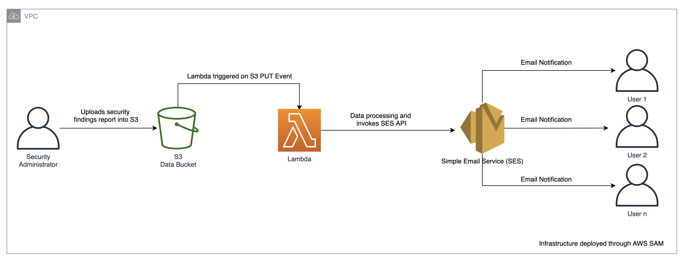

# Automated Image Augmentation

## Project Overview
 Image augmentation is a technique of altering the existing data to create some more data for the model training process. In other words, it is the process of artificially expanding the available dataset for training a deep learning model. This repository demonstrates an automated workflow to generate additional training images through image augmentation to facilitate Computer Vision/Image Classification projects.

## Prerequisite 
To effectively spin up the project using the AWS SAM Framework, you'd require the following prerequisites:
* [AWS CLI](https://docs.aws.amazon.com/cli/latest/userguide/cli-chap-install.html)
* [AWS SAM CLI](https://docs.aws.amazon.com/serverless-application-model/latest/developerguide/serverless-sam-cli-install-mac.html)

## How it Works
Upon successful deployment, users can upload raw training images into the S3 bucket denoted `raw images` which triggers an image augmentation script (script denoted in image_augmentation_function/app.py) to run on the original training image, generates a predetermined number of augmented images, and stores them in the bucket denoted `augmented images`. 
 
 
## Set up Guide
**Step 1**: Clone this project into your local environment 

**Step 2**: At the root folder, run `sam build`

**Step 3**: Upon successful build, deploy the project with `sam deploy --guided`

## Author
* Glendon Thaiw ([GitHub](https://github.com/glendont) | [LinkedIn](https://www.linkedin.com/in/glendonthaiw/))

 ## Resources
 * [AWS Serverless Application Model (SAM) Documentation](https://docs.aws.amazon.com/serverless-application-model/index.html) 
 * [Global sections of the AWS SAM Template](https://docs.aws.amazon.com/serverless-application-model/latest/developerguide/sam-specification-template-anatomy-globals.html)
 * [Working with AWS Lambda and Lambda Layers in AWS SAM](https://aws.amazon.com/blogs/compute/working-with-aws-lambda-and-lambda-layers-in-aws-sam/)
